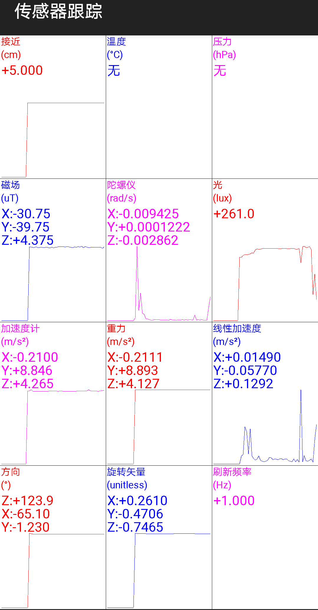
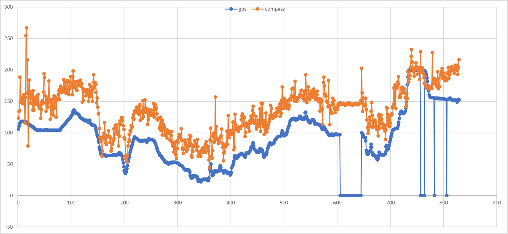

- Smartphone sensor data：

- Because the posture of the smartphone could be arbitrary, so we need the gps bearing and road heading to correct the compass, below show some difference between compass and gps bearing.

